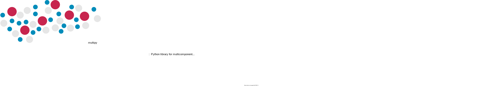

====================================================================================================
|logoimage|
====================================================================================================

.. image:: https://img.shields.io/badge/GitHub-multipy-blue.svg?style=flat
    :target: https://github.com/kamilazdybal/multipy
.. image:: http://img.shields.io/badge/license-MIT-blue.svg?style=flat
    :target: https://github.com/kamilazdybal/multipy
.. image:: https://readthedocs.org/projects/multipy-lib/badge/?version=latest
    :target: https://multipy-lib.readthedocs.io/en/latest/?badge=latest

--------------------------------------------------------------------------------

***********
Motivation
***********

  *Study hard what interests you the most in the most undisciplined, irreverent and original manner possible.*

  **\- Richard P. Feynman**

This library is intended to support your learning of multicomponent mass transfer.
The goal was to create a set of functions that are the essential building blocks
with which you can play to get more intuition and understanding of quantities
involved in multicomponent flows. With a fair amount of linear algebra and matrix operations, we
paid special attention to document the equations along with the sizes of matrices.
With these tools you can set-up your
own problems such as the `Stefan tube <file:///Users/kamilazdybal/GitLab-Multiscale-Utah/multipy/docs/_build/html/tutorials/non-reacting-stefan-tube-mole-fractions.html>`_
or the `two-bulb diffusion <file:///Users/kamilazdybal/GitLab-Multiscale-Utah/multipy/docs/_build/html/tutorials/two-bulb-diffusion.html>`_
without a whole lot of coding. We wish you a lot of joy in studying multicomponent mass transfer!

--------------------------------------------------------------------------------

***********
Credits
***********

Many materials helped in creating this library:

- ``[1]`` J. C. Sutherland - *Multicomponent mass transfer* course, `CHEN-6603 <https://sutherland.che.utah.edu/teaching/chen6603/>`_, The University of Utah, 2012
- ``[2]`` R. Taylor, R. Krishna - *Multicomponent mass transfer*, Wiley, 1993
- ``[3]`` R. B. Bird, W. E. Stewart, E. N. Lightfoot, D. J. Klingenberg - *Introductory transport phenomena*, Wiley, 2015
- ``[4]`` H. M. Shey - *Div, Grad, Curl, and All that: An Informal Text on Vector Calculus*, W.W. Norton & Company, 2005
- ``[5]`` A. Ern, V. Giovangigli - *Multicomponent transport algorithms*, Springer Science & Business Media, 1994
- ``[6]`` V. Giovangigli - *Multicomponent flow modeling*, Birkhäuser Boston, 1999
- ``[7]`` H. Brenner - *Kinematics of volume transport*, Physica A: Statistical Mechanics and its Applications, 349(1-2), pp.11-59
- ``[8]`` H. Brenner - *Navier-Stokes revisited*, Physica A: Statistical Mechanics and its Applications, 349(1-2), pp.60-132
- ``[9]`` H. T. Cullinan, Jr. - *Analysis of the flux equations of multicomponent diffusion*, Industrial & Engineering Chemistry Fundamentals, 4(2) (1965) 133-139
- ``[10]`` J. C. Sutherland, C. A. Kennedy - *Improved boundary conditions for viscous, reacting, compressible flows*, Journal of Computational Physics 191 (2003) 502-524
- ``[11]`` M. A. Hansen, J. C. Sutherland - *On the consistency of state vectors and Jacobian matrices*, Combustion and Flame 193 (2018) 257-271
- ``[12]`` J. C. Sutherland, P. J. Smith, J. H. Chen - *Quantification of differential diffusion in nonpremixed systems*, Combustion Theory and Modelling 9(2) (2005) 365-383
- ``[13]`` G. Sanderson - `The diffusion equation <https://youtu.be/a3V0BJLIo_c>`_

All of the above are also great references to support your learning and broaden your knowledge!

--------------------------------------------------------------------------------

****************************
Documentation & User Guide
****************************

.. toctree::
    :maxdepth: 1
    :caption: User Guide

    user/composition
    user/velocity
    user/flux
    user/diffusion
    user/transform
    user/checks

.. toctree::
    :maxdepth: 1
    :caption: Theory & Notation

    theory/notation
    theory/quantities
    theory/governing-equations
    theory/derivations
