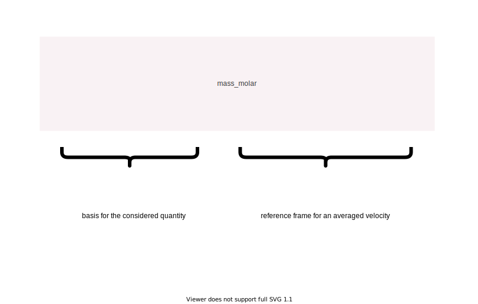
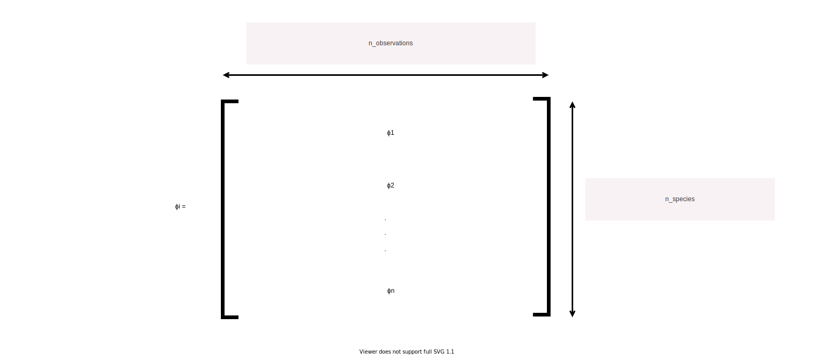

###################################################
Notation
###################################################

.. contents:: Table of contents
   :depth: 5

This part of the documentation presents notations for all ``multipy`` quantities.

--------------------------------------------------------------------------------

**************************************
Indexing
**************************************

- :math:`i` denotes that a quantity is related to an :math:`i^{th}` component of the mixture.
- :math:`n` represents the number of components (species) of the mixture.

--------------------------------------------------------------------------------

**************************************
Bases and reference frames
**************************************

Multicomponent quantities can often be written in various bases (e.g. mass or molar)
and in reference to different average velocity of the mixture (e.g. mass-averaged or molar-averged).
To keep track of a basis and a reference frame related to mixture velocity, we adopted the following
notation in naming functions or parameters:

As an example, ``Flux.diffusive_mass_molar`` should be interpreted as a **mass** diffusive flux
relative to a **molar**-averaged velocity.

--------------------------------------------------------------------------------

*******************************************************
Shape of a general multicomponent quantity matrix
*******************************************************

We assume that a matrix :math:`\pmb{\phi}_i \in \mathcal{R}^{n \times N}` describes any multicomponent quantity,
where :math:`n` is the number of components (species) in the mixture and :math:`N`
is the number of observations of that quantity (for instance spatial positions).
Mixture components are thus stored in rows and their observations are stored in columns:

--------------------------------------------------------------------------------

**************************************
Vector calculus primer
**************************************

Gradient
========

For a scalar function :math:`f`, the gradient of :math:`f` is denoted:

.. math::

  \nabla f

In three dimensions we can compute this as:

.. math::

  \begin{gather}
  f
  \begin{bmatrix}
  \frac{\partial}{\partial x} \\
  \frac{\partial}{\partial y} \\
  \frac{\partial}{\partial z} \\
  \end{bmatrix}
  =
  \begin{bmatrix}
  \frac{\partial f}{\partial x} \\
  \frac{\partial f}{\partial y} \\
  \frac{\partial f}{\partial z} \\
  \end{bmatrix}
  \end{gather}

This results in a vector.

For a vector function :math:`\mathbf{f}`, the gradient of :math:`\mathbf{f}` is denoted:

.. math::

  \nabla \mathbf{f}

In three dimensions we can compute this as:

.. math::

  \begin{gather}
  \begin{bmatrix}
  \frac{\partial}{\partial x} \\
  \frac{\partial}{\partial y} \\
  \frac{\partial}{\partial z} \\
  \end{bmatrix}
  \cdot
  \begin{bmatrix}
  f_x & f_y & f_z \\
  \end{bmatrix}
  =
  \begin{bmatrix}
  \frac{\partial f_x}{\partial x} & \frac{\partial f_y}{\partial x} & \frac{\partial f_z}{\partial x}\\
  \frac{\partial f_x}{\partial y} & \frac{\partial f_y}{\partial y} & \frac{\partial f_z}{\partial y}\\
  \frac{\partial f_x}{\partial z} & \frac{\partial f_y}{\partial z} & \frac{\partial f_z}{\partial z}\\
  \end{bmatrix}
  \end{gather}

This results in a tensor.

Divergence
==========

For a vector function :math:`\mathbf{f}`, the divergence of :math:`\mathbf{f}` is denoted:

.. math::

  \nabla \cdot \mathbf{f}

In three dimensions we can compute this as:

.. math::

  \begin{gather}
  \begin{bmatrix}
  \frac{\partial}{\partial x} & \frac{\partial}{\partial y} & \frac{\partial}{\partial z}
  \end{bmatrix}
  \cdot
  \begin{bmatrix}
  f_x \\
  f_y \\
  f_z \\
  \end{bmatrix}
  =
  \frac{\partial f_x}{\partial x} + \frac{\partial f_y}{\partial y} + \frac{\partial f_z}{\partial z}
  \end{gather}

This results in a scalar.

Outer product
=============

The outer product between matrices ``A`` and ``B`` can be computed using ``numpy`` as:

.. code::

  numpy.outer(A,B)

Tensor contraction
==================

For two tensors, :math:`\mathbf{A}` and :math:`\mathbf{B}`, tensor contraction (scalar product) is denoted:

.. math::

  \mathbf{A} : \mathbf{B}

The tensor contraction (scalar product) between matrices ``A`` and ``B`` can be computed using ``numpy`` as:

.. code::

  numpy.tensordot(A,B,axes=2)

which achieves the same thing as:

.. code::

  numpy.sum(numpy.multiply(A,B))

Various forms of the divergence theorem
======================================================

- For a scalar field :math:`\phi`:  :math:`\int_{S(t)} \phi \mathbf{a} dS = \int_{V(t)} \nabla \phi dV`
- For a vector field :math:`\mathbf{q}`:  :math:`\int_{S(t)} \mathbf{q} \cdot \mathbf{a} dS = \int_{V(t)} \nabla \cdot \mathbf{q} dV`
- For a tensor field :math:`\pmb{\tau}`:  :math:`\int_{S(t)} \pmb{\tau} \cdot \mathbf{a} dS = \int_{V(t)} \nabla \cdot \pmb{\tau} dV`
