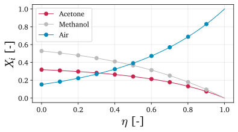

##########################################################
Non-reacting Stefan tube: species mole fractions
##########################################################

In this tutorial, we demonstrate how ``multipy`` functionalities can be used to compute species mole fractions numerically and analytically in a one-dimensional, non-reacting Stefan tube.

.. note::

  This tutorial has been computed using a Jupyter notebook that can be accessed |tutorial_link|.

==========
Highlights
==========

.. |tutorial_link| raw:: html

   <a href="https://mybinder.org/v2/gh/kamilazdybal/multipy/main?labpath=%2Fdocs%2Ftutorials%2Fnon-reacting-stefan-tube-mole-fractions.ipynb" target="_blank">here</a>
