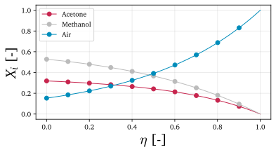

##########################################################
Non-reacting Stefan tube: species mole fractions
##########################################################

In this tutorial, we demonstrate how ``multipy`` functionalities can be
used to compute species mole fractions numerically and analytically in a
one-dimensional, non-reacting Stefan tube.

.. note::

  This tutorial has been computed using a Jupyter notebook that can be accessed |tutorial_link|.

--------------

We start by importing the necessary modules:

.. code:: python

    import multipy
    import numpy as np
    from scipy.sparse.linalg import expm
    from scipy.integrate import odeint
    from scipy.optimize import fmin
    from plotly import graph_objects as go

    %run -i styles.py
    %matplotlib inline

We instantiate objects of the ``Composition`` class (that will be
necessary for computing composition-related quantities), of the
``Templates`` class (that contains useful building blocks that we will
use here) and of the ``Check`` class (that will be useful for performing
some basic checks on the computed quantities):

.. code:: python

    composition = multipy.Composition()
    templates = multipy.Templates()
    check = multipy.Check()

.. code:: python

    filename_prefix = 'non-reacting-stefan-tube'

Problem set-up
--------------

In this tutorial, we will consider the Stefan tube problem - a
one-dimensional flow of species inside a long tube. At the bottom of the
tube there is a liquid mixture of acetone and methanol, which both
evaporate and move upwards the tube. The tube is open to the atmosphere
at the top. Air can enter the tube and is thus the third component of
the mixture, moving downwards the tube. We will consider a pseudo
steady-state condition in which the liquid is fully saturated with air.
We also assume that no chemical reactions take place.

The Stefan tube problem is schematically presented below:

We assume the following species ordering:

.. raw:: html

   

1. Acetone

.. raw:: html

   

.. raw:: html

   

2. Methanol

.. raw:: html

   

.. raw:: html

   

3. Air

.. raw:: html

   

We thus have three species:

.. code:: python

    n_species = 3

We can create a list of species names:

.. code:: python

    species_names = ['Acetone', 'Methanol', 'Air']

We set the temperature :math:`T` in :math:`[K]`:

.. code:: python

    T = 328.5

Pressure :math:`p` in :math:`[Pa]`:

.. code:: python

    p = 101325

Mixture molar density :math:`c` in :math:`[mole/m^3]`:

.. code:: python

    mixture_molar_density = composition.mixture_molar_density(T, p)

Species molar masses :math:`M_i` in :math:`[kg/mole]`:

.. code:: python

    species_molar_masses = np.array([[58.08/1000], [32.04/1000], [28.9628/1000]])

Binary diffusivities :math:`\mathcal{D}` in :math:`[m^2/s]`:

.. code:: python

    D12 = 8.48 / 1000**2
    D21 = D12
    D13 = 13.72 / 1000**2
    D31 = D13
    D23 = 19.91 / 1000**2
    D32 = D23

We can now create a diagonal matrix of size ``(3, 3)`` that contains the
binary diffusivities:

.. code:: python

    D_binary = np.array([[0, D12, D13],
                         [D21, 0, D23],
                         [D31, D32, 0]])

If we print the ``D_binary`` matrix we should see:

.. code:: python

    print(D_binary)

Next, we are going to discretize the spatial domain in the :math:`z`
direction. The length of the domain :math:`l` in :math:`[m]` is:

.. code:: python

    length = 0.238

We are going to non-dimensionalize the domain and instead of
representing it in the :math:`z` coordinates, we will represent it in
the normalized :math:`\eta` coordinates which change from 0 to 1. We are
free to select the number of points in the spatial domain (observations)
that will be generated.

Discretization of the domain in the :math:`\eta` :math:`[-]` space:

.. code:: python

    n_points = 1000

.. code:: python

    eta_coordinates = np.linspace(0,1,n_points)

.. code:: python

    delta_eta = eta_coordinates[1] - eta_coordinates[0]

We also define the initial condition, :math:`\mathbf{X}_i(\eta=0)`,
which are the known mole fractions of acetone and methanol at the liquid
surface, :math:`\eta=0`:

.. code:: python

    initial_condition = np.array([0.319, 0.528])

and define the boundary condition, :math:`\mathbf{X}_i(\eta=1)`, which
are the known mole fractions at the tube outlet, :math:`\eta=1`:

.. code:: python

    boundary_condition = np.array([0,0,1])

--------------

Pause and ponder
----------------

Before we dive into solving the Stefan tube problem, let's pause for a
while and think a little more about what is happening inside the tube.
At different positions :math:`z`, we have different proportions of air
to acetone and methanol. This means that the *mass* density of the
mixture, :math:`\rho`, does not have to be constant throughout the tube.
In fact, we know it's not. Since air has much lower mass density than
acetone and methanol, close to the tube outlet the mixture density will
be lower than closer to the liquid surface. The mixture density is thus
a function of position in the tube: :math:`\rho = \rho(z)`. This can
also be shown by looking at the ideal gas law:

.. math::

   \rho(z) = \frac{p M(z)}{R T}

since for different compositions at different positions in the tube we
will have different values for the molar mass of the mixture,
:math:`M = M(z)`.

The same is not true about the *molar* density of the mixture,
:math:`c`. Since the mixture is an ideal gas at standard temperature and
pressure, we can show that :math:`c` is constant:

.. math::

   c = \frac{n}{V} = \frac{p}{RT}

as long as the temperature and pressure are constant. This might seem
weird at first, but yet another way to think about this is that there is
the same amount of *stuff* (moles) throughout the tube, it's just
*different stuff* at different positions. This is conceptually presented
in the figure below:

Finally, let's take a closer look at the governing equations that can
help us solve the Stefan tube problem.

We can use the species moles conservation equation:

.. math::

   \frac{d (c \mathbf{X}_i)}{dt} = - \nabla \cdot \mathbf{N}_i + s_i

where :math:`\mathbf{N}_i` is the total molar flux of species :math:`i`
and :math:`s_i` is the net molar production rate of species :math:`i`.

Since we've assumed a (pseudo) steady-state, the time derivative seen on
the left hand side evaluates to 0. We also assume no reactions, so
:math:`s_i = 0`. The species mole conservation equation thus simplifies
to:

.. math::

   - \nabla \cdot \mathbf{N}_i = 0

We consider only one spatial direction, so the divergence operator can
be written for the three species as:

.. math::

   \begin{equation}
   \begin{cases}
   - \frac{d N_1}{dz} = 0 \\
   - \frac{d N_2}{dz} = 0 \\
   - \frac{d N_3}{dz} = 0
   \end{cases}
   \end{equation}

which must mean that all three total molar fluxes are constants:
:math:`N_1 = C_1`, :math:`N_1 = C_2`, :math:`N_1 = C_3`, where in
general all constants :math:`C_1`, :math:`C_2` and :math:`C_3` can be
different.

Compute species mole fractions, :math:`\mathbf{X}_i`
----------------------------------------------------

We start with computing the mole fraction profiles of all three species
inside the Stefan tube.

The system of linear ODEs that we need to solve is:

.. math::

   \frac{d \mathbf{X}_i}{d \eta} = \mathbf{\Phi} \mathbf{X}_i + \pmb{\phi}

where:

.. math::

   \Phi_{ii} = \frac{\mathbf{N}_i}{c_t \mathcal{D}_{i,n}/l} + \sum_{k \neq i}^{n} \frac{\mathbf{N}_k}{c_t \mathcal{D}_{i,k}/l}

.. math::

   \Phi_{ij} = \mathbf{N}_i \Big( \frac{1}{c_t \mathcal{D}_{i,n}/l} - \frac{1}{c_t \mathcal{D}_{i,j}/l} \Big)

.. math::

   \phi_i = - \frac{\mathbf{N}_i}{c_t \mathcal{D}_{i,n}/l}

We will use the available function
`Templates.stefan_diffusion <https://multipy-lib.readthedocs.io/en/latest/user/templates.html#multipy.templates.Templates.stefan_diffusion>`_
that will compute entries in the matrix :math:`\mathbf{\Phi}` and in the
vector :math:`\pmb{\phi}` according to the above formulas. While this
function computes these using a generic vector :math:`\pmb{\alpha}` and
a generic matrix :math:`\pmb{\beta}`, in our case:

-  :math:`\pmb{\alpha} = \mathbf{N}_i`
-  :math:`\pmb{\beta} = \frac{c}{l}\pmb{\mathcal{D}}`

Even though an analytic solution exists, let's begin by solving this
system of equations numerically.

Solve numerically using ``scipy.integrate.odeint``
~~~~~~~~~~~~~~~~~~~~~~~~~~~~~~~~~~~~~~~~~~~~~~~~~~

We will use the Python function
`scipy.integrate.odeint <https://docs.scipy.org/doc/scipy/reference/generated/scipy.integrate.odeint.html>`__
to compute the mole fractions numerically.

Note that ``odeint`` can be used for *initial value* first order systems
of ODEs. The independent variable allowed for ``odeint`` can be
monotonically increasing or decreasing - in our case this is going to be
the normalized spatial coordinates :math:`\eta`. The *initial value*
corresponds to the first element of the independent variable and in our
case this will be the mole fractions at the liquid surface
:math:`x(\eta=0)`.

For our Stefan tube problem, the system of ODEs in the matrix form can
be re-written as a system of two ODEs:

.. math::

   \begin{equation}
   \begin{cases}
   \frac{dX_1}{d \eta} = \Phi_{11} X_1 + \Phi_{12} X_2 + \phi_1 \\
   \frac{dX_2}{d \eta} = \Phi_{12} X_1 + \Phi_{22} X_2 + \phi_2
   \end{cases}
   \end{equation}

subject to initial condition:

.. math::

   \begin{equation}
   \begin{cases}
   X_1(\eta=0) = 0.319 \\
   X_2(\eta=0) = 0.528
   \end{cases}
   \end{equation}

Note that we solve only two ODEs, since we can get the third mole
fraction from the relation:

.. math::

   \sum_{i = 1}^n X_i = 1

Define the function that will compute the right hand side (RHS) of the
system of ODEs:

.. code:: python

    def RHS_ODE(x, time_vector, N, D_binary, mixture_molar_density, length):

        x1, x2 = x

        (phi, Phi) = templates.stefan_diffusion(N[:,None], mixture_molar_density / length * D_binary)

        gradient_x_acetone = Phi[0,0] * x1 + Phi[0,1] * x2 + phi[0]
        gradient_x_methanol = Phi[1,0] * x1 + Phi[1,1] * x2 + phi[1]

        dxdeta = np.array([gradient_x_acetone, gradient_x_methanol])

        return dxdeta.ravel()

Note that in this problem, we don't know the total molar fluxes,
:math:`\mathbf{N}_i`. One way to go about this is to take an initial
guess and see if after solving the system of ODEs we satisfy the
boundary condition. The second way is to use an optimization algorithm
that will search for the correct values of the total molar fluxes. We
will present the latter approach next. For now, we define the total
molar flux vector using the optimized solution that we will soon obtain.

Define the total molar flux :math:`\mathbf{N}_i` in
:math:`[mole/(m^2s)]`:

.. code:: python

    N1 = 0.0018175355801046177
    N2 = 0.0031885688320410326
    N3 = 0

    N = np.array([N1, N2, N3])

Solve the two ODEs numerically:

.. code:: python

    numerical_solution = odeint(RHS_ODE, initial_condition, eta_coordinates, args=(N, D_binary, mixture_molar_density, length))

Get the mole fractions computed numerically:

.. code:: python

    mole_fractions_numerical = np.vstack((numerical_solution[:,0], numerical_solution[:,1], 1 - numerical_solution[:,0] - numerical_solution[:,1]))

    composition.set_species_mole_fractions = mole_fractions_numerical

We check if the values at the boundary match the expected mole
fractions:

.. math::

   \begin{equation}
   \begin{cases}
   X_1(\eta=1) = 0 \\
   X_2(\eta=1) = 0 \\
   X_3(\eta=1) = 1
   \end{cases}
   \end{equation}

.. code:: python

    print('Mole fraction of acetone at the tube outlet:\t' + str(round(mole_fractions_numerical[0,-1], 5)))
    print('Mole fraction of methanol at the tube outlet:\t' + str(round(mole_fractions_numerical[1,-1], 5)))
    print('Mole fraction of air at the tube outlet:\t' + str(round(mole_fractions_numerical[2,-1],5)))

We also check if the mole fractions of all three species sum to 1.0 and
if the mole fractions are bounded between 0 and 1 at any given position
inside the tube:

.. code:: python

    idx = check.sum_of_species_fractions(mole_fractions_numerical, tolerance=0.000001, verbose=True)
    idx = check.range_of_species_fractions(mole_fractions_numerical, tolerance=0.000001, verbose=True)

Note that the only reason why we obtained a correct solution is that we
already knew the correct total molar fluxes.

Plot the species mole fractions:

.. code:: python

    composition.plot_species_mole_fractions(species_names=species_names,
                                            colors=colors,
                                            figsize=(6,3),
                                            filename='../images/stefan-tube-mole-fractions-numerical.svg');

 ### Solve for the total molar fluxes using an optimization algorithm

Here, we will extend the numerical solution by including an optimization
algorithm that will compute the correct total molar fluxes for us. We
will use the Python function
`scipy.optimize.fmin <https://docs.scipy.org/doc/scipy/reference/generated/scipy.optimize.fmin.html>`__
to search for a minimum of an error function that we will define
ourselves.

We start by the turning numerical computation of the mole fractions into
a function that returns an error. The error will be measured as the
difference between the expected boundary condition and the numerically
obtained values for mole fractions at the tube outlet:

.. code:: python

    def error_function(fluxes):

        (N1, N2) = fluxes

        N = np.array([N1, N2, 0])

        numerical_solution = odeint(RHS_ODE, initial_condition, eta_coordinates, args=(N, D_binary, mixture_molar_density, length))

        mole_fractions_numerical = np.vstack((numerical_solution[:,0], numerical_solution[:,1], 1 - numerical_solution[:,0] - numerical_solution[:,1]))

        # Calculate an error between the current mole fractions at the boundary and the boundary condition:
        error = np.linalg.norm(boundary_condition - mole_fractions_numerical[:,-1])

        return error

We can first visualize the error surface as computed from the
``error_function`` for a range of values for the first two total molar
fluxes, :math:`N_1` and :math:`N_2`:

.. code:: python

    n_grid = 100
    grid_range = np.linspace(0.001,0.004,n_grid)
    N1_vector, N2_vector = np.meshgrid(grid_range, grid_range)
    N1_vector = N1_vector.ravel()
    N2_vector = N2_vector.ravel()
    error_vector = np.zeros(len(N1_vector))
    for k in range(0, len(N1_vector)):
            error = error_function((N1_vector[k], N2_vector[k]))
            error_vector[k] = error
    error_matrix_numerical = np.log(np.reshape(error_vector, (n_grid, n_grid)))

    fig = go.Figure(data=[go.Surface(x=grid_range, y=grid_range, z=error_matrix_numerical, colorscale='inferno', showscale=False)])
    fig.update_layout(autosize=False,
                    width=1000, height=600,
                    margin=dict(l=65, r=50, b=65, t=90),
                    scene = dict(
                    xaxis_title='N1',
                    yaxis_title='N2',
                    zaxis_title='log(Error)'))
    fig.show()

From the plot above we could already take a reasonable guess for the
values of :math:`N_1` and :math:`N_2` where the error function attains
the minimum value.

Finally, we compute the optimized solution numerically:

.. code:: python

    minimum = fmin(func=error_function, x0=(0.001, 0.001), xtol=10**-8, ftol=10**-8)
    print('Total molar flux of acetone should be:\t' + str(minimum[0]))
    print('Total molar flux of methanol should be:\t' + str(minimum[1]))

Note that the optimized values for :math:`N_1` and :math:`N_2` are the
ones that we used at the start of this numerical solution.

Solve analytically
~~~~~~~~~~~~~~~~~~

The analytic solution is:

.. math::

   \mathbf{X} = \exp[\mathbf{\Phi} \cdot \eta] \mathbf{X}_0 + (\exp[\mathbf{\Phi} \cdot \eta] - \mathbf{I}) \mathbf{\Phi}^{-1} \phi

where :math:`\exp[\mathbf{\Phi} \cdot \eta]` is the exponential of the
matrix :math:`\mathbf{\Phi} \cdot \eta` defined as:

.. math::

   \exp[\mathbf{\Phi} \cdot \eta] = \mathbf{I} + \mathbf{\Phi} \cdot \eta + \frac{1}{2!} (\mathbf{\Phi} \cdot \eta)^2 + \dots = \sum_{k=0}^{\infty} \frac{1}{k!} (\mathbf{\Phi} \cdot \eta)^k

which is a generalization of the Maclaurin series for matrices. See
reference `[2] <#references>`__ (Appendix A-B) for the full derivation
of this form of the solution.

We are going to use the Python function
`scipy.sparse.linalg.expm <https://docs.scipy.org/doc/scipy/reference/generated/scipy.linalg.expm.html>`__
to compute the matrix exponentials seen in the analytic solution.

.. code:: python

    (phi, Phi) = templates.stefan_diffusion(N[:,None], mixture_molar_density / length * D_binary)

    species_mole_fractions = np.zeros((3,n_points))

    for i, eta in enumerate(eta_coordinates):

        species_mole_fractions[0:2,i:i+1] = np.dot(expm(Phi*eta), initial_condition[:,None]) + np.dot((expm(Phi*eta) - np.identity(2)), np.dot(np.linalg.inv(Phi), phi))
        species_mole_fractions[2,i] = 1 - np.sum(species_mole_fractions[0:2,i])

Similarly as for the numerical solution, we check if the values at the
boundary match the expected mole fractions:

.. math::

   X_1(\eta=1) = 0 \\
   X_2(\eta=1) = 0 \\
   X_3(\eta=1) = 1

.. code:: python

    print('Mole fraction of acetone at the tube outlet:\t' + str(round(species_mole_fractions[0,-1], 5)))
    print('Mole fraction of methanol at the tube outlet:\t' + str(round(species_mole_fractions[1,-1], 5)))
    print('Mole fraction of air at the tube outlet:\t' + str(round(species_mole_fractions[2,-1],5)))

and check if the mole fractions of all three species sum to 1.0 at any
given position inside the tube:

.. code:: python

    idx = check.sum_of_species_fractions(species_mole_fractions, tolerance=0.000001, verbose=True)
    idx = check.range_of_species_fractions(species_mole_fractions, tolerance=0.000001, verbose=True)

Set the computed mole fractions as the ``Composition`` class atribute:

.. code:: python

    composition.set_species_mole_fractions = species_mole_fractions

Note, that also for the analytic solution we could have used an
optimization algorithm to compute the total molar fluxes, if we didn't
know them already.

Plot the mole fractions:

.. code:: python

    composition.plot_species_mole_fractions(species_names=species_names,
                                            colors=colors,
                                            figsize=(6,3),
                                            filename='../images/' + filename_prefix + '_species-mole-fractions.svg');

Save the computed quantities
----------------------------

Finally, we save the computed quantities for use in other tutorials:

.. code:: python

    np.savetxt('csv/' + filename_prefix + '_species-mole-fractions.csv', (species_mole_fractions), delimiter=',', fmt='%.16e')

References
----------

-  `[1] <#>`__ J. C. Sutherland - *Multicomponent mass transfer* course,
   `CHEN-6603 <https://sutherland.che.utah.edu/teaching/chen6603/>`__,
   The University of Utah
-  `[2] <#solve-analytically>`__ R. Taylor, R. Krishna - *Multicomponent
   mass transfer*, Wiley, 1993

--------------

.. |tutorial_link| raw:: html

   <a href="https://mybinder.org/v2/gh/kamilazdybal/multipy/main?labpath=%2Fdocs%2Ftutorials%2Fnon-reacting-stefan-tube-mole-fractions.ipynb" target="_blank">here</a>
